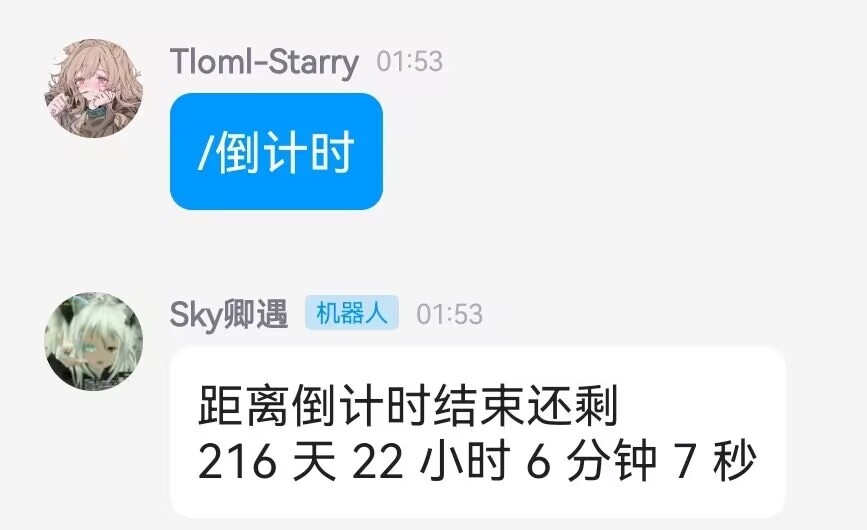
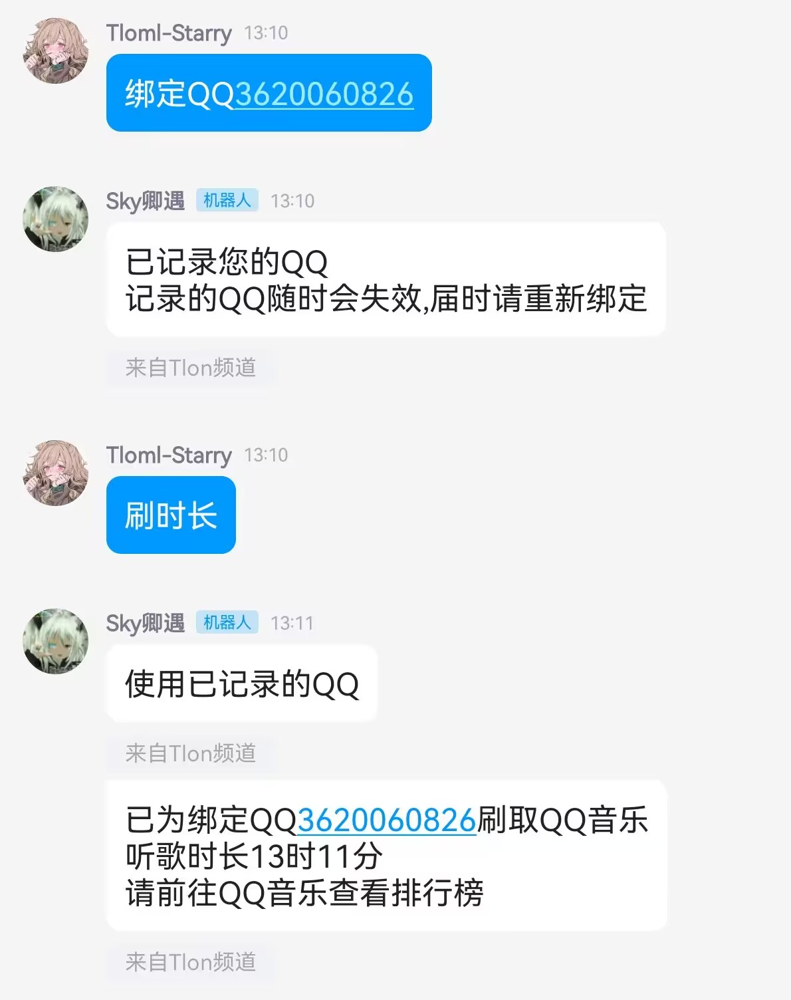

# 
Alemon-TS插件

- [x] 刷QQ音乐听歌时长

- [x] 自定义倒计时

- [ ] 待添加

自定义倒计时

#### 介绍
计算到指定日期所剩多久

#### 安装&使用教程
下载压缩包解压将TS放到`alemon-bot\example`位置即可,使用指令`/倒计时`

#### 配置
需要打开文件自己配置倒计时指定日期

刷听歌时长

#### 介绍
刷取QQ音乐听歌时长

#### 安装&使用教程
下载压缩包解压将TS放到`alemon-bot\example`位置即可,使用指令`绑定QQ` `刷时长`

#### 开发不易

 * 点个Star就是对我最大的支持!或者为我赞助提供动力[爱发电](https://afdian.net/a/Tloml-Starry)
 * 一起玩耍↓
 * Q群：[392665563](https://jq.qq.com/?_wv=1027&k=VQAEpAlH)
 * 我的频道：[Tlon-Sky](https://pd.qq.com/s/bclm3owlx)
