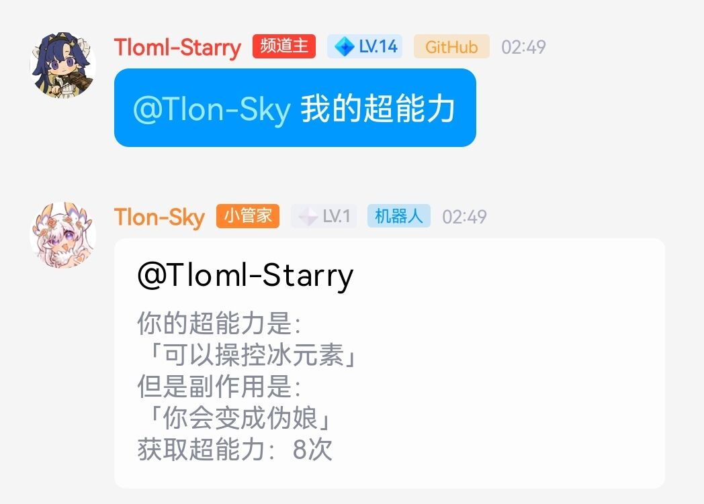
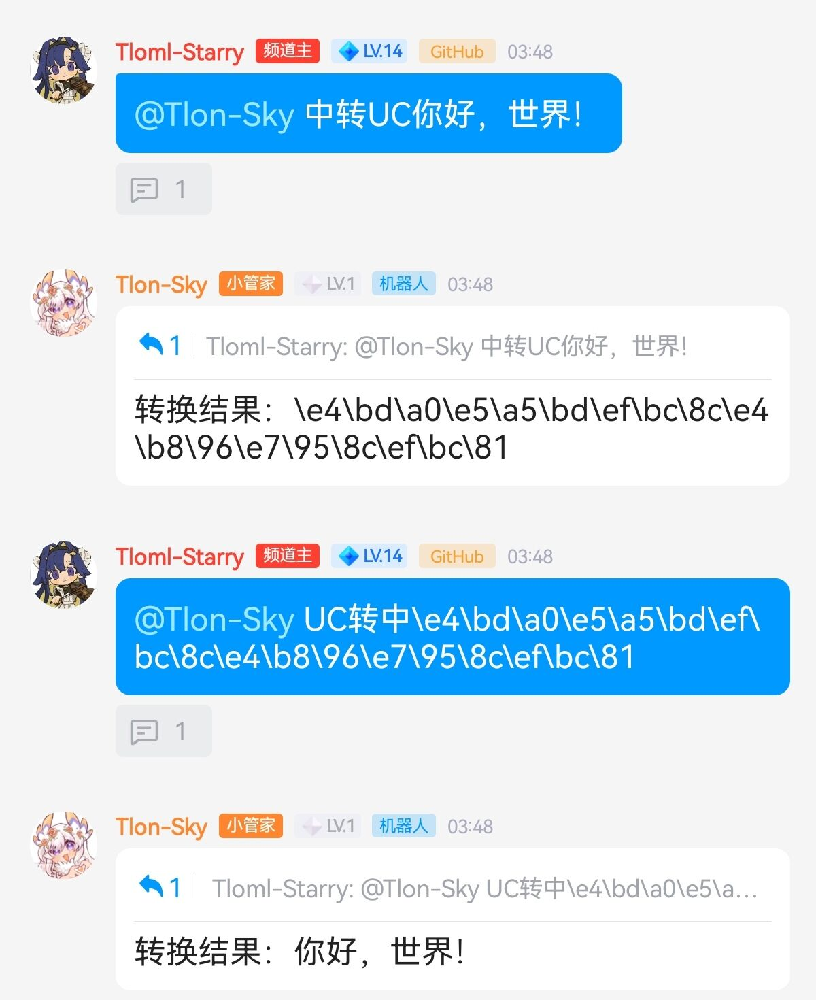

# 
Alemon-TS插件

- [x] 刷QQ音乐听歌时长

- [x] 自定义倒计时

- [x] 转码

- [x] 我的超能力

- [x] UC互转(PS:水插件)

自定义倒计时

#### 介绍
计算到指定日期所剩多久

#### 安装&使用教程
下载压缩包解压将[自定义倒计时.TS](https://gitee.com/Tloml-Starry/Tlon-Alemon-Bot/blob/master/自定义倒计时.ts)放到`alemon-bot\example`位置即可,使用指令`/倒计时`

#### 配置
需要打开文件自己配置倒计时指定日期

刷听歌时长

#### 介绍
刷取QQ音乐听歌时长

#### 安装&使用教程
下载压缩包解压将[刷时长.TS](https://gitee.com/Tloml-Starry/Tlon-Alemon-Bot/blob/master/刷时长.ts)放到`alemon-bot\example`位置即可,使用指令`绑定QQ` `刷时长`

转码

#### 介绍
将链接转为二维码

#### 安装&使用教程
下载压缩包解压将[转码.TS](https://gitee.com/Tloml-Starry/Tlon-Alemon-Bot/blob/master/转码.ts)放到`alemon-bot\example`位置即可,使用指令`转码+链接`,链接必须带https前缀,否则不支持识别

我的超能力

#### 介绍
随机一种超能力与副作用

#### 安装&使用教程
下载压缩包解压将[我的超能力.TS](https://gitee.com/Tloml-Starry/Tlon-Alemon-Bot/blob/master/我的超能力.ts)放到`alemon-bot\example`位置即可,使用指令`我的超能力`

UC互转

#### 介绍
将UniCode字符串转换为中文

#### 安装&使用教程
下载压缩包解压将[UC互转.TS](https://gitee.com/Tloml-Starry/Tlon-Alemon-Bot/blob/master/UC互转.ts)放到`alemon-bot\example`位置即可,使用指令`US转中+UniCode字符串` `中转UC+中文`

#### 开发不易

 * 点个Star就是对我最大的支持!或者为我赞助提供动力[爱发电](https://afdian.net/a/Tloml-Starry)
 * 一起玩耍↓
 * Q群：[392665563](https://jq.qq.com/?_wv=1027&k=VQAEpAlH)
 * 我的频道：[Tlon-Sky](https://pd.qq.com/s/bclm3owlx)